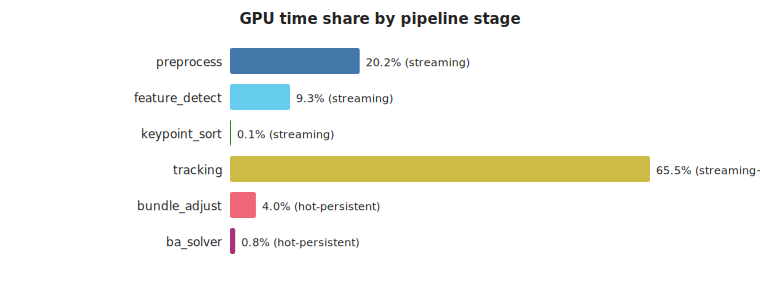
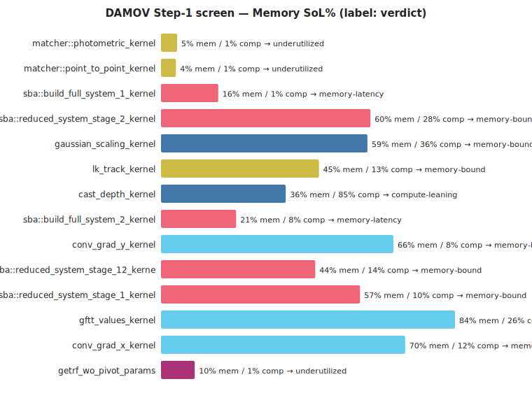
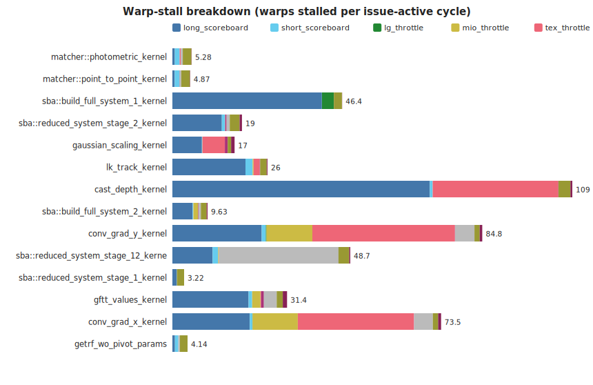
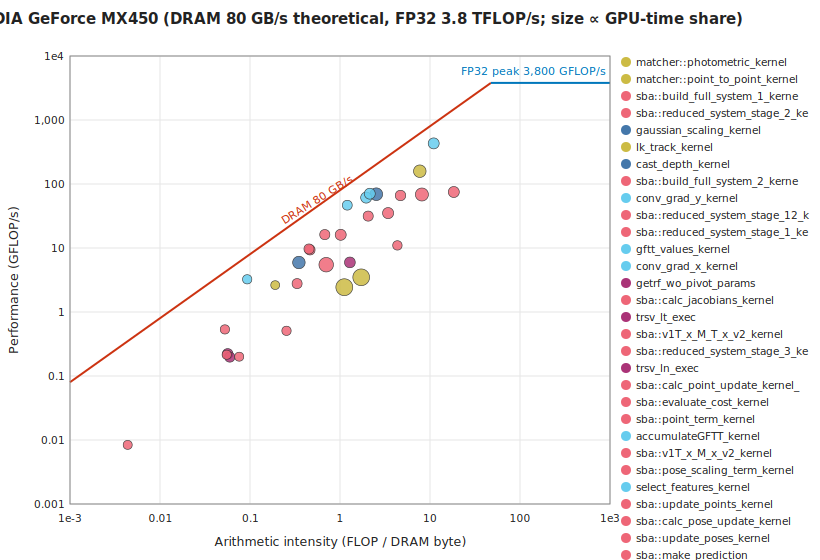
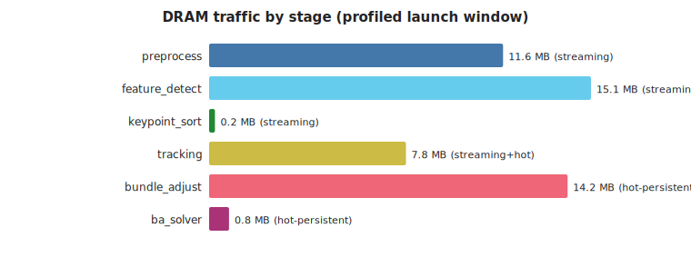
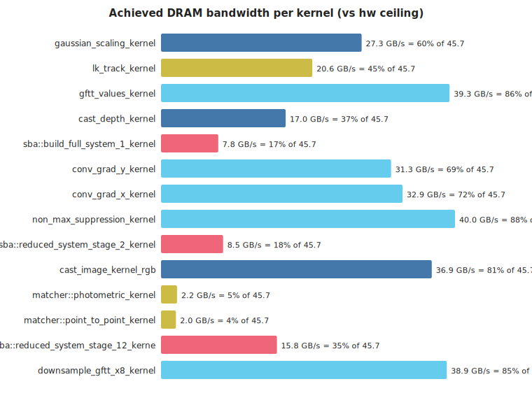
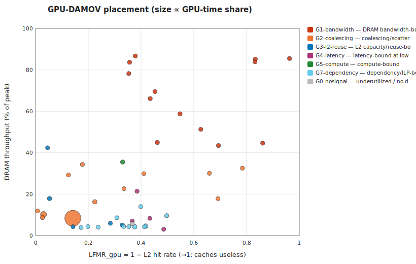

# cuVSLAM memory characterization — TUM fr3 long_office, MX450 (prototype pass)

*Generated 2026-07-03 12:03 by `analysis/make_report.py` — headless, stdlib-only.*

## 1. Provenance

**Hardware descriptor:** `hw/mx450_sm75.toml` — NVIDIA GeForce MX450 (Turing, sm_75, 14 SMs, L2 512 KiB, DRAM 80.0 GB/s theoretical, no ECC). Role: **prototype**.

- **run:** `2026-07-02_160048_seq_nsys_mx450_sm75`
  - GPU NVIDIA GeForce MX450 · driver 610.43.02 · clocks 1035 MHz/3000 MHz
  - config `profiling/configs/tum_office_profile.toml` · frames as-config · cuvslam 15.0.0
  - nsys NVIDIA Nsight Systems version 2026.1.3.425-261338342291v0

- **run:** `2026-07-02_162034_freiburg3longofficehouse_ncu_mx450_sm75`
  - GPU NVIDIA GeForce MX450 · driver 610.43.02 · clocks 1035 MHz/3000 MHz
  - config `profiling/configs/tum_office_profile.toml` · frames as-config · cuvslam 15.0.0
  - ncu NVIDIA (R) Nsight Compute Command Line Profiler
  - ncu window: launch-skip 14333 · launch-count 300 · metrics `characterize`

- **run:** `2026-07-02_160244_freiburg3longofficehouse_nsys_mx450_sm75`
  - GPU NVIDIA GeForce MX450 · driver 610.43.02 · clocks 1035 MHz/3000 MHz
  - config `profiling/configs/tum_office_slam_profile.toml` · frames as-config · cuvslam 15.0.0
  - nsys NVIDIA Nsight Systems version 2026.1.3.425-261338342291v0

- **run:** `2026-07-02_162329_freiburg3longofficehouse_ncu_mx450_sm75`
  - GPU NVIDIA GeForce MX450 · driver 610.43.02 · clocks 1035 MHz/3000 MHz
  - config `profiling/configs/tum_office_slam_profile.toml` · frames {'start_index': 0, 'max_frames': 1500} · cuvslam 15.0.0
  - ncu NVIDIA (R) Nsight Compute Command Line Profiler
  - ncu window: launch-skip 40 · launch-count 120 · metrics `characterize`

> ⚠ **Prototype-hardware caveat:** this GPU cannot lock clocks; numbers here support methodology and relative comparisons, not publishable absolutes. Re-run on the production descriptor for report-grade data.

## 2. Pipeline decomposition (kernel→stage DAG)

Workload: 260 frames, 18633 kernel launches (71.7/frame), 45 unique kernels, total GPU time 573.8 ms.

| stage | persistence hypothesis | what it is | GPU time % | launches | kernels |
|---|---|---|---|---|---|
| preprocess | streaming | image cast + Gaussian pyramid construction | 20.2 | 3120 | 3 |
| feature_detect | streaming | GFTT/Harris gradients, response, NMS, selection | 9.4 | 3227 | 8 |
| keypoint_sort | streaming | cub::DeviceMergeSort of detected keypoints | 0.1 | 90 | 3 |
| tracking | streaming+hot | Lucas–Kanade pyramidal optical-flow tracking | 65.5 | 9082 | 4 |
| bundle_adjust | hot-persistent | sparse bundle adjustment: system build + reduce + update | 4 | 2316 | 20 |
| ba_solver | hot-persistent | dense linear solve (cuSOLVER getrf/trsv) for BA | 0.8 | 798 | 7 |

## 3. DAMOV Step-1 screen — which kernels are memory-bound

Rule (GPU adaptation): *memory-bound* if Memory-SoL ≥ 40% and ≥ 1.5× Compute-SoL; *memory-latency* if both SoLs are low but the dominant warp stall is a memory stall. Time-weighted across launches.

| kernel | stage | verdict | MemSoL% | CompSoL% | L1 hit% | L2 hit% | sectors/req (ld) |
|---|---|---|---|---|---|---|---|
| matcher::photometric_kernel | tracking | underutilized | 4.59 | 0.89 | 85.85 | 58.26 | 22.27 |
| matcher::point_to_point_kernel | tracking | underutilized | 4.25 | 0.91 | 56.08 | 62.43 | 22.2 |
| sba::build_full_system_1_kernel | bundle_adjust | memory-latency | 16.31 | 1.1 | 79.74 | 77.52 | 15.09 |
| sba::reduced_system_stage_2_kernel | bundle_adjust | memory-bound | 59.62 | 27.84 | 31.54 | 94.7 | 3.95 |
| gaussian_scaling_kernel | preprocess | memory-bound | 58.77 | 35.96 | 91.37 | 45.24 | 0 |
| lk_track_kernel | tracking | memory-bound | 44.94 | 12.88 | 82.17 | 53.83 | 2.33 |
| cast_depth_kernel | preprocess | compute-leaning | 35.51 | 84.87 | 2.14 | 66.99 | 2 |
| sba::build_full_system_2_kernel | bundle_adjust | memory-latency | 21.38 | 7.86 | 55.75 | 61.52 | 6.25 |
| conv_grad_y_kernel | feature_detect | memory-bound | 66.14 | 7.5 | 46.71 | 56.53 | 0 |
| sba::reduced_system_stage_12_kernel | bundle_adjust | memory-bound | 43.89 | 14.47 | 33.84 | 82.23 | 3.37 |
| sba::reduced_system_stage_1_kernel | bundle_adjust | memory-bound | 56.65 | 10.41 | 98.12 | 97.39 | 26.22 |
| gftt_values_kernel | feature_detect | memory-bound | 83.68 | 26.45 | 54.91 | 64.35 | 0 |
| conv_grad_x_kernel | feature_detect | memory-bound | 69.5 | 11.64 | 58.87 | 54.74 | 0 |
| getrf_wo_pivot_params | ba_solver | underutilized | 9.61 | 0.74 | 39.67 | 50.26 | 3 |
| sba::clear_full_system_stage_1_kernel | bundle_adjust | memory-bound | 79.07 | 4.79 | 96.82 | 99.24 | 0 |
| sba::calc_jacobians_kernel | bundle_adjust | memory-bound | 48.33 | 2.34 | 83.92 | 87.5 | 15.94 |

### Warp-stall breakdown

## 4. Roofline placement

| kernel | stage | AI (FLOP/DRAM-byte) | GFLOP/s | DRAM GB/s |
|---|---|---|---|---|
| matcher::photometric_kernel | tracking | 1.12 | 2.44 | 2.18 |
| matcher::point_to_point_kernel | tracking | 1.72 | 3.48 | 2.03 |
| sba::build_full_system_1_kernel | bundle_adjust | 0.7 | 5.48 | 7.8 |
| sba::reduced_system_stage_2_kernel | bundle_adjust | 8.12 | 68.66 | 8.45 |
| gaussian_scaling_kernel | preprocess | 2.53 | 69.18 | 27.32 |
| lk_track_kernel | tracking | 7.7 | 158.62 | 20.61 |
| cast_depth_kernel | preprocess | 0.35 | 5.93 | 16.97 |
| sba::build_full_system_2_kernel | bundle_adjust | 3.42 | 35.05 | 10.24 |
| conv_grad_y_kernel | feature_detect | 1.96 | 61.26 | 31.33 |
| sba::reduced_system_stage_12_kernel | bundle_adjust | 1.02 | 16.08 | 15.78 |
| sba::reduced_system_stage_1_kernel | bundle_adjust | 18.38 | 74.91 | 4.08 |
| gftt_values_kernel | feature_detect | 10.98 | 431.58 | 39.29 |
| conv_grad_x_kernel | feature_detect | 2.14 | 70.55 | 32.9 |
| getrf_wo_pivot_params | ba_solver | 1.29 | 5.95 | 4.62 |

## 5. DRAM traffic by stage

### Host↔device transfers (data movement the kernel view misses)

Explicit memcpy/memset time is **134 ms vs 574 ms of kernel time (23%)**; Host-to-Device moves **1.68 MB/frame** (the sensor-image upload — traffic a near-sensor substrate eliminates outright). Full table: `data/transfers.csv`.

## 6. Loop-closure (SLAM layer) delta

SLAM capture: full-sequence frames, 47 unique kernels (baseline had 45).

Kernels present **only** with `[slam]` enabled — the cold-persistent candidates:

| kernel | stage | persistence | GPU time % | launches |
|---|---|---|---|---|
| st_track_with_cache_kernel | slam_loop | cold-persistent | 69.06 | 379 |
| st_build_cache_kernel | slam_loop | cold-persistent | 0.32 | 289 |

Their per-kernel memory profile (ncu, `characterize` set):

| kernel | verdict | MemSoL% | CompSoL% | L2 hit% | occupancy% | sectors/req (ld) | DRAM MB/launch |
|---|---|---|---|---|---|---|---|
| st_track_with_cache_kernel | memory-latency | 9.14 | 1.26 | 85.86 | 3.12 | 18.05 | 23.5 |
| st_build_cache_kernel | memory-bound | 73.68 | 3.89 | 96.99 | 3.13 | 24.91 | 0.8 |

## 7. GPU-DAMOV classification — PiM/ISP candidates

Bottleneck classes per the GPU-adapted DAMOV taxonomy (`suggestions_and_summuries/Adapting_DAMOV_to_GPU.md` §6; [Oliveira21] for the CPU original). This is the NCU-counter **first-cut** classification — single-point LFMR_gpu (= 1 − L2 hit), MPKI, DRAM-SoL, coalescing, occupancy, stall taxonomy. The gated Slice-3 trace/simulation track refines it (LFMR-vs-#SM trend, divergence, true reuse distance) but is not required to produce it.

**Synthesis — stage → dominant class → PiM/ISP affinity** (time-weighted within stage):

| stage | persistence | dominant class | share | PiM affinity | substrate |
|---|---|---|---|---|---|
| preprocess | streaming | G1-bandwidth | 57% of stage time | strong | near-sensor SRAM (consume before DRAM) |
| feature_detect | streaming | G1-bandwidth | 99% of stage time | strong | near-sensor SRAM (consume before DRAM) |
| keypoint_sort | streaming | G4-latency | 34% of stage time | strong | near-memory compute (latency, uncacheable set) |
| tracking | streaming+hot | G7-dependency | 88% of stage time | none | host GPU — raise occupancy/ILP first, then re-screen |
| bundle_adjust | hot-persistent | G2-coalescing | 58% of stage time | conditional | scatter-capable PiM — or a data-layout fix first |
| ba_solver | hot-persistent | G7-dependency | 52% of stage time | none | host GPU — raise occupancy/ILP first, then re-screen |
| slam_loop | cold-persistent | G2-coalescing | 100% of stage time | strong | ISP / near-storage scan engine |

Per-kernel placement (top by profiled time; full table in `data/classification.csv`). *Stability* = the class survives all decision thresholds perturbed ±25%:

| kernel | class | conf | stability | PiM | substrate | rationale |
|---|---|---|---|---|---|---|
| st_track_with_cache_kernel | G2-coalescing | high | stable | strong | ISP / near-storage scan engine | 18 sectors/request (4 = coalesced) |
| st_build_cache_kernel | G2-coalescing | high | stable | conditional | scatter-capable PiM — or a data-layout fix first | 25 sectors/request (4 = coalesced) |
| matcher::photometric_kernel | G7-dependency | medium | stable | none | host GPU — raise occupancy/ILP first, then re-screen | 'wait' stall dominant at 16% occupancy; memory is not the wall (MemSoL 5%, DRAM-SoL 5%); note: scattered access (22 sect/req) — re-screen for PiM once occupancy is fixed |
| matcher::point_to_point_kernel | G7-dependency | medium | stable | none | host GPU — raise occupancy/ILP first, then re-screen | 'wait' stall dominant at 15% occupancy; memory is not the wall (MemSoL 4%, DRAM-SoL 4%); note: scattered access (22 sect/req) — re-screen for PiM once occupancy is fixed |
| sba::build_full_system_1_kernel | G2-coalescing | medium | stable | conditional | scatter-capable PiM — or a data-layout fix first | 15 sectors/request (4 = coalesced) |
| sba::reduced_system_stage_2_kernel | G3-l2-reuse | medium | stable | weak | bigger/persisted L2 wins; PiM would forfeit the reuse | memory-limited but LFMR 0.05 — the L2 is earning its keep |
| gaussian_scaling_kernel | G1-bandwidth | high | stable | strong | near-sensor SRAM (consume before DRAM) | DRAM-SoL 59%; LFMR 0.55 (L2 not helping) |
| lk_track_kernel | G1-bandwidth | low | stable | strong | near-sensor SRAM (consume before DRAM) | memory-limited (MemSoL 45%) without a sharper signature |
| cast_depth_kernel | G5-compute | low | stable | none | host GPU | CompSoL 85% dominant, AI 0.3 FLOP/B; only n=2 profiled launches — small sample |
| sba::build_full_system_2_kernel | G4-latency | medium | borderline:G2-coalescing↔G3-l2-reuse↔G4-latency | conditional | raise occupancy first; PiM if the set defeats caches | long-scoreboard dominant at 23% occupancy, DRAM-SoL 21% |
| conv_grad_y_kernel | G1-bandwidth | high | stable | strong | near-sensor SRAM (consume before DRAM) | DRAM-SoL 66%; LFMR 0.43 (L2 not helping) |
| sba::reduced_system_stage_12_kernel | G2-coalescing | medium | borderline:G0-nosignal↔G2-coalescing | conditional | scatter-capable PiM — or a data-layout fix first | 10 sectors/request (4 = coalesced) |
| sba::reduced_system_stage_1_kernel | G2-coalescing | high | stable | conditional | scatter-capable PiM — or a data-layout fix first | 26 sectors/request (4 = coalesced) |
| gftt_values_kernel | G1-bandwidth | low | stable | strong | near-sensor SRAM (consume before DRAM) | DRAM-SoL 84%; LFMR 0.36 (L2 absorbing reuse); only n=1 profiled launches — small sample |

Threshold sensitivity: 36/47 kernels keep their class under ±25% threshold perturbation; 11 are borderline (flagged above and in the CSV).

## 8. Persistence-class evidence so far

| stage | hypothesis | evidence in this capture |
|---|---|---|
| preprocess | streaming | 1/3 profiled kernels memory-bound |
| feature_detect | streaming | 8/8 profiled kernels memory-bound |
| keypoint_sort | streaming | 2/3 profiled kernels memory-bound |
| tracking | streaming+hot | 2/4 profiled kernels memory-bound |
| bundle_adjust | hot-persistent | 16/20 profiled kernels memory-bound |
| ba_solver | hot-persistent | 2/7 profiled kernels memory-bound |

Methodology caveats: ncu flushes caches between replay passes, so hit rates are cold-start (steady-state needs the gated Accel-Sim track); SoL/stall/traffic counters are robust. Simulated numbers, when they arrive, are reported as deltas, not absolutes.
