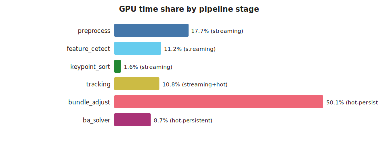
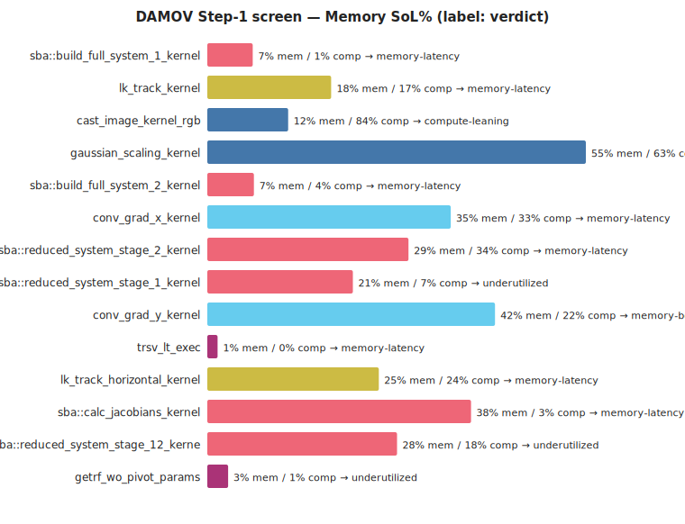
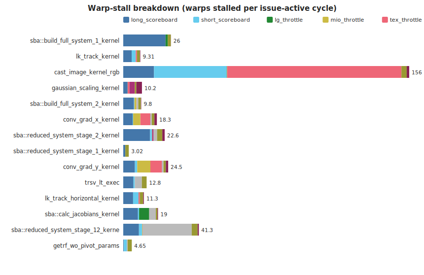
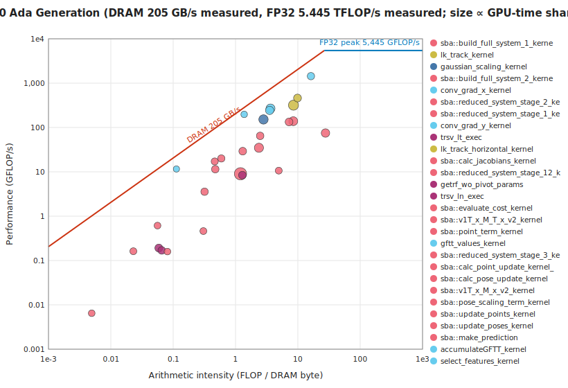
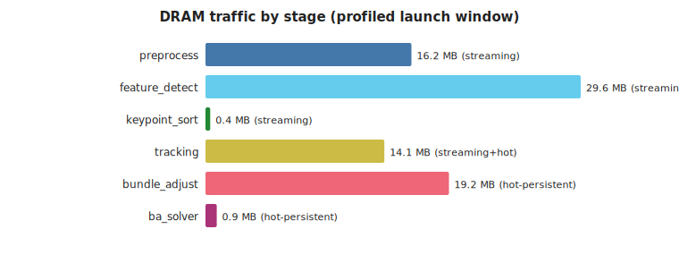
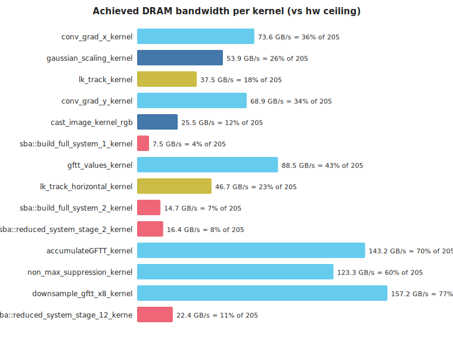
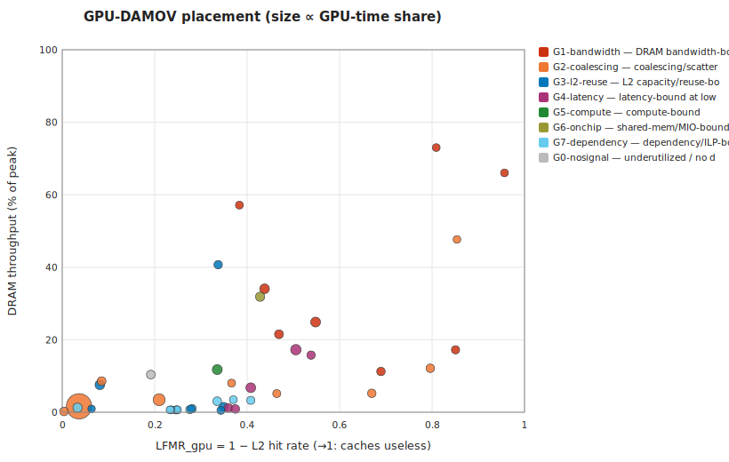

# cuVSLAM memory characterization — KITTI 06 color stereo, RTX 2000 Ada (locked clocks)

*Generated 2026-07-03 13:25 by `analysis/make_report.py` — headless, stdlib-only.*

## 1. Provenance

**Hardware descriptor:** `hw/dellworkstation_sm89.toml` — NVIDIA RTX 2000 Ada Generation (Ampere/Ada, sm_89, 22 SMs, L2 24576 KiB, DRAM 224.0 GB/s theoretical, no ECC). Role: **production**.

- **run:** `2026-07-03_125255_kitti06_nsys_dellworkstation_sm89`
  - GPU NVIDIA RTX 2000 Ada Generation · driver 610.43.02 · clocks 1620 MHz/7001 MHz
  - config `profiling/configs/kitti06_color_profile.toml` · frames as-config · cuvslam 15.0.0
  - nsys NVIDIA Nsight Systems version 2026.1.3.425-261338342291v0

- **run:** `2026-07-03_125342_kitti06_ncu_dellworkstation_sm89`
  - GPU NVIDIA RTX 2000 Ada Generation · driver 610.43.02 · clocks 1620 MHz/7001 MHz
  - config `profiling/configs/kitti06_color_profile.toml` · frames as-config · cuvslam 15.0.0
  - ncu NVIDIA (R) Nsight Compute Command Line Profiler
  - ncu window: launch-skip 19075 · launch-count 300 · metrics `characterize`

- **run:** `2026-07-03_125430_kitti06_nsys_dellworkstation_sm89`
  - GPU NVIDIA RTX 2000 Ada Generation · driver 610.43.02 · clocks 1620 MHz/7001 MHz
  - config `profiling/configs/kitti06_color_slam_profile.toml` · frames as-config · cuvslam 15.0.0
  - nsys NVIDIA Nsight Systems version 2026.1.3.425-261338342291v0

- **run:** `2026-07-03_125529_kitti06_ncu_dellworkstation_sm89`
  - GPU NVIDIA RTX 2000 Ada Generation · driver 610.43.02 · clocks 1620 MHz/7001 MHz
  - config `profiling/configs/kitti06_color_slam_profile.toml` · frames as-config · cuvslam 15.0.0
  - ncu NVIDIA (R) Nsight Compute Command Line Profiler
  - ncu window: launch-skip 40 · launch-count 120 · metrics `characterize`

## 2. Pipeline decomposition (kernel→stage DAG)

Workload: 260 frames, 24798 kernel launches (95.4/frame), 42 unique kernels, total GPU time 190.2 ms.

| stage | persistence hypothesis | what it is | GPU time % | launches | kernels |
|---|---|---|---|---|---|
| preprocess | streaming | image cast + Gaussian pyramid construction | 17.7 | 1745 | 2 |
| feature_detect | streaming | GFTT/Harris gradients, response, NMS, selection | 11.1 | 3578 | 8 |
| keypoint_sort | streaming | cub::DeviceMergeSort of detected keypoints | 1.6 | 623 | 3 |
| tracking | streaming+hot | Lucas–Kanade pyramidal optical-flow tracking | 10.8 | 607 | 2 |
| bundle_adjust | hot-persistent | sparse bundle adjustment: system build + reduce + update | 50.1 | 13933 | 20 |
| ba_solver | hot-persistent | dense linear solve (cuSOLVER getrf/trsv) for BA | 8.7 | 4312 | 7 |

## 3. DAMOV Step-1 screen — which kernels are memory-bound

Rule (GPU adaptation): *memory-bound* if Memory-SoL ≥ 40% and ≥ 1.5× Compute-SoL; *memory-latency* if both SoLs are low but the dominant warp stall is a memory stall. Time-weighted across launches.

| kernel | stage | verdict | MemSoL% | CompSoL% | L1 hit% | L2 hit% | sectors/req (ld) |
|---|---|---|---|---|---|---|---|
| sba::build_full_system_1_kernel | bundle_adjust | memory-latency | 6.6 | 1.33 | 85.45 | 79.04 | 14.05 |
| lk_track_kernel | tracking | memory-latency | 18 | 16.9 | 82.57 | 49.45 | 2.3 |
| cast_image_kernel_rgb | preprocess | compute-leaning | 11.76 | 83.96 | 52.68 | 66.46 | 4.77 |
| gaussian_scaling_kernel | preprocess | mixed | 55.04 | 63.16 | 91.38 | 45.2 | 0 |
| sba::build_full_system_2_kernel | bundle_adjust | memory-latency | 6.78 | 4.37 | 57.72 | 59.2 | 7.35 |
| conv_grad_x_kernel | feature_detect | memory-latency | 35.39 | 33.22 | 56.99 | 56.24 | 0 |
| sba::reduced_system_stage_2_kernel | bundle_adjust | memory-latency | 29.25 | 33.99 | 42.02 | 91.86 | 3.95 |
| sba::reduced_system_stage_1_kernel | bundle_adjust | underutilized | 21.16 | 7.3 | 95.79 | 96.7 | 26.74 |
| conv_grad_y_kernel | feature_detect | memory-bound | 41.83 | 21.91 | 45.5 | 57.19 | 0 |
| trsv_lt_exec | ba_solver | memory-latency | 1.5 | 0.27 | 27.27 | 65.08 | 1.5 |
| lk_track_horizontal_kernel | tracking | memory-latency | 24.93 | 23.66 | 86.77 | 53.11 | 2.33 |
| sba::calc_jacobians_kernel | bundle_adjust | memory-latency | 38.35 | 2.76 | 76.9 | 91.48 | 15.25 |
| sba::reduced_system_stage_12_kernel | bundle_adjust | underutilized | 27.59 | 18.09 | 36.72 | 80.83 | 3.4 |
| getrf_wo_pivot_params | ba_solver | underutilized | 3.03 | 0.71 | 39.67 | 66.48 | 6 |
| trsv_ln_exec | ba_solver | memory-latency | 1.48 | 0.17 | 27.27 | 64.06 | 1.5 |
| sba::clear_full_system_stage_1_kernel | bundle_adjust | memory-bound | 46.52 | 5.84 | 37.66 | 99.62 | 0 |

### Warp-stall breakdown

## 4. Roofline placement

| kernel | stage | AI (FLOP/DRAM-byte) | GFLOP/s | DRAM GB/s |
|---|---|---|---|---|
| sba::build_full_system_1_kernel | bundle_adjust | 1.2 | 9.05 | 7.53 |
| lk_track_kernel | tracking | 8.51 | 318.8 | 37.46 |
| cast_image_kernel_rgb | preprocess | 0 | 0 | 25.53 |
| gaussian_scaling_kernel | preprocess | 2.81 | 151.62 | 53.9 |
| sba::build_full_system_2_kernel | bundle_adjust | 2.38 | 34.91 | 14.68 |
| conv_grad_x_kernel | feature_detect | 3.64 | 268.31 | 73.64 |
| sba::reduced_system_stage_2_kernel | bundle_adjust | 8.45 | 138.58 | 16.4 |
| sba::reduced_system_stage_1_kernel | bundle_adjust | 27.72 | 74.93 | 2.7 |
| conv_grad_y_kernel | feature_detect | 3.53 | 243.21 | 68.85 |
| trsv_lt_exec | ba_solver | 0.06 | 0.19 | 3.24 |
| lk_track_horizontal_kernel | tracking | 9.88 | 461.86 | 46.75 |
| sba::calc_jacobians_kernel | bundle_adjust | 7.22 | 133.52 | 18.5 |
| sba::reduced_system_stage_12_kernel | bundle_adjust | 1.3 | 29.23 | 22.43 |
| getrf_wo_pivot_params | ba_solver | 1.29 | 8.41 | 6.54 |

## 5. DRAM traffic by stage

### Host↔device transfers (data movement the kernel view misses)

Explicit memcpy/memset time is **55 ms vs 190 ms of kernel time (29%)**; Host-to-Device moves **1.94 MB/frame** (the sensor-image upload — traffic a near-sensor substrate eliminates outright). Full table: `data/transfers.csv`.

## 6. Loop-closure (SLAM layer) delta

SLAM capture: 1101 frames, 44 unique kernels (baseline had 42).

Kernels present **only** with `[slam]` enabled — the cold-persistent candidates:

| kernel | stage | persistence | GPU time % | launches |
|---|---|---|---|---|
| st_track_with_cache_kernel | slam_loop | cold-persistent | 62.8 | 196 |
| st_build_cache_kernel | slam_loop | cold-persistent | 1.21 | 390 |

Their per-kernel memory profile (ncu, `characterize` set):

| kernel | verdict | MemSoL% | CompSoL% | L2 hit% | occupancy% | sectors/req (ld) | DRAM MB/launch |
|---|---|---|---|---|---|---|---|
| st_build_cache_kernel | memory-latency | 33.01 | 2.67 | 96.36 | 2.08 | 27.53 | 0.3 |

## 7. GPU-DAMOV classification — PiM/ISP candidates

Bottleneck classes per the GPU-adapted DAMOV taxonomy (`suggestions_and_summuries/Adapting_DAMOV_to_GPU.md` §6; [Oliveira21] for the CPU original). This is the NCU-counter **first-cut** classification — single-point LFMR_gpu (= 1 − L2 hit), MPKI, DRAM-SoL, coalescing, occupancy, stall taxonomy. The gated Slice-3 trace/simulation track refines it (LFMR-vs-#SM trend, divergence, true reuse distance) but is not required to produce it.

**Synthesis — stage → dominant class → PiM/ISP affinity** (time-weighted within stage):

| stage | persistence | dominant class | share | PiM affinity | substrate |
|---|---|---|---|---|---|
| preprocess | streaming | G5-compute | 52% of stage time | none | host GPU |
| feature_detect | streaming | G1-bandwidth | 57% of stage time | strong | near-sensor SRAM (consume before DRAM) |
| keypoint_sort | streaming | G3-l2-reuse | 40% of stage time | weak | weak, cache-friendly |
| tracking | streaming+hot | G4-latency | 79% of stage time | strong | near-memory compute (latency, uncacheable set) |
| bundle_adjust | hot-persistent | G2-coalescing | 52% of stage time | conditional | scatter-capable PiM — or a data-layout fix first |
| ba_solver | hot-persistent | G7-dependency | 45% of stage time | none | host GPU — raise occupancy/ILP first, then re-screen |
| slam_loop | cold-persistent | G2-coalescing | 100% of stage time | conditional | scatter-capable PiM — or a data-layout fix first |

Per-kernel placement (top by profiled time; full table in `data/classification.csv`). *Stability* = the class survives all decision thresholds perturbed ±25%:

| kernel | class | conf | stability | PiM | substrate | rationale |
|---|---|---|---|---|---|---|
| st_build_cache_kernel | G2-coalescing | high | stable | conditional | scatter-capable PiM — or a data-layout fix first | 28 sectors/request (4 = coalesced) |
| sba::build_full_system_1_kernel | G2-coalescing | medium | stable | conditional | scatter-capable PiM — or a data-layout fix first | 14 sectors/request (4 = coalesced) |
| lk_track_kernel | G4-latency | medium | stable | strong | near-memory compute (latency, uncacheable set) | long-scoreboard dominant at 18% occupancy, DRAM-SoL 17% |
| cast_image_kernel_rgb | G5-compute | low | stable | none | host GPU | CompSoL 84% dominant, AI 0.0 FLOP/B; only n=4 profiled launches — small sample |
| gaussian_scaling_kernel | G1-bandwidth | low | borderline:G1-bandwidth↔G5-compute | strong | near-sensor SRAM (consume before DRAM) | memory-limited (MemSoL 55%) without a sharper signature |
| sba::build_full_system_2_kernel | G4-latency | medium | borderline:G2-coalescing↔G3-l2-reuse↔G4-latency | strong | near-memory compute (latency, uncacheable set) | long-scoreboard dominant at 15% occupancy, DRAM-SoL 7% |
| conv_grad_x_kernel | G1-bandwidth | low | stable | strong | near-sensor SRAM (consume before DRAM) | memory-limited (MemSoL 35%) without a sharper signature |
| sba::reduced_system_stage_2_kernel | G3-l2-reuse | medium | borderline:G3-l2-reuse↔G5-compute | weak | bigger/persisted L2 wins; PiM would forfeit the reuse | memory-limited but LFMR 0.08 — the L2 is earning its keep |
| sba::reduced_system_stage_1_kernel | G7-dependency | medium | stable | none | host GPU — raise occupancy/ILP first, then re-screen | 'wait' stall dominant at 2% occupancy; memory is not the wall (MemSoL 21%, DRAM-SoL 1%); note: scattered access (27 sect/req) — re-screen for PiM once occupancy is fixed |
| conv_grad_y_kernel | G6-onchip | medium | borderline:G1-bandwidth↔G6-onchip | none | host GPU | dominant stall mio_throttle (7.2 warps) with DRAM unsaturated |
| trsv_lt_exec | G3-l2-reuse | medium | borderline:G3-l2-reuse↔G4-latency | weak | bigger/persisted L2 wins; PiM would forfeit the reuse | memory-limited but LFMR 0.35 — the L2 is earning its keep |
| lk_track_horizontal_kernel | G1-bandwidth | low | borderline:G1-bandwidth↔G4-latency | strong | near-sensor SRAM (consume before DRAM) | memory-limited (MemSoL 25%) without a sharper signature |
| sba::calc_jacobians_kernel | G2-coalescing | high | stable | conditional | scatter-capable PiM — or a data-layout fix first | 27 sectors/request (4 = coalesced) |
| sba::reduced_system_stage_12_kernel | G0-nosignal | low | stable | n/a | — | no dominant bottleneck signal (short/latency-tax kernels) |

Threshold sensitivity: 27/43 kernels keep their class under ±25% threshold perturbation; 16 are borderline (flagged above and in the CSV).

## 8. Persistence-class evidence so far

| stage | hypothesis | evidence in this capture |
|---|---|---|
| preprocess | streaming | 0/2 profiled kernels memory-bound |
| feature_detect | streaming | 4/8 profiled kernels memory-bound |
| keypoint_sort | streaming | 2/3 profiled kernels memory-bound |
| tracking | streaming+hot | 2/2 profiled kernels memory-bound |
| bundle_adjust | hot-persistent | 14/20 profiled kernels memory-bound |
| ba_solver | hot-persistent | 2/7 profiled kernels memory-bound |

Methodology caveats: ncu flushes caches between replay passes, so hit rates are cold-start (steady-state needs the gated Accel-Sim track); SoL/stall/traffic counters are robust. Simulated numbers, when they arrive, are reported as deltas, not absolutes.
