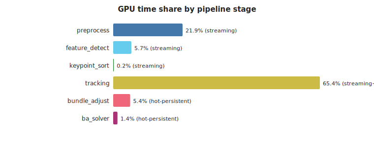
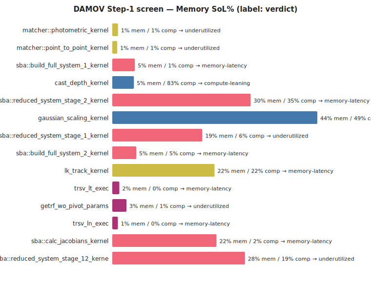
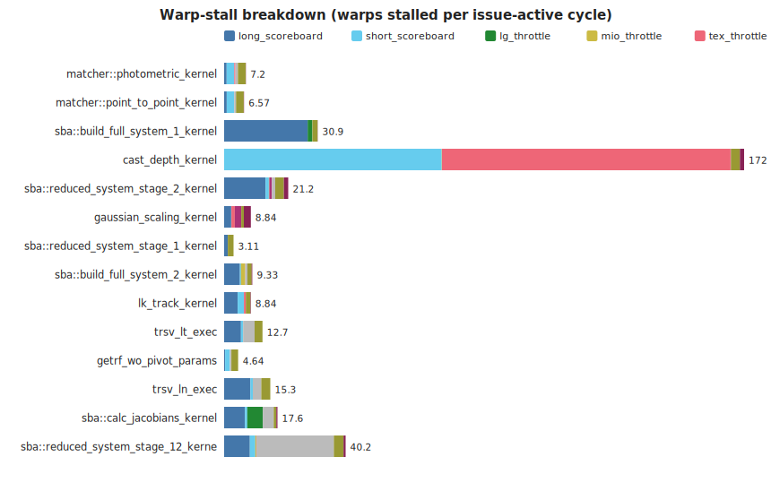
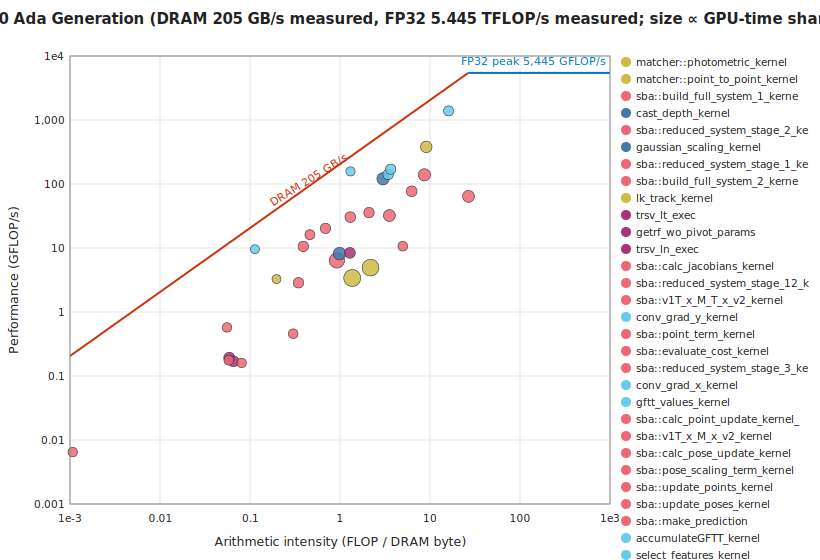
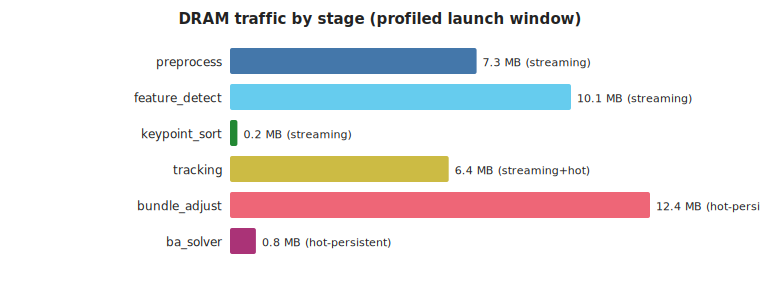
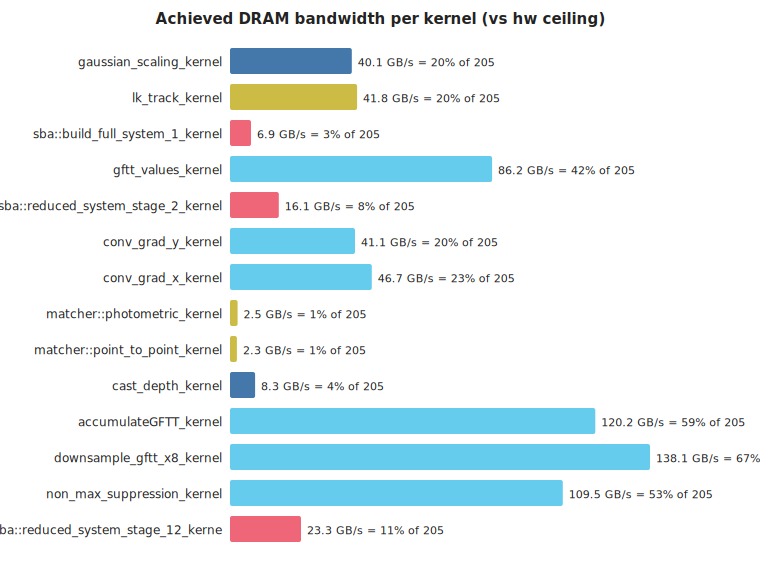
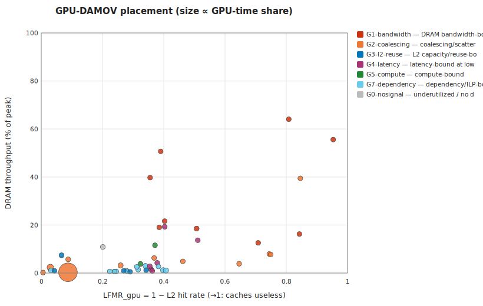

# cuVSLAM memory characterization — TUM fr3 long_office, RTX 2000 Ada (PRODUCTION, locked clocks)

*Generated 2026-07-03 13:23 by `analysis/make_report.py` — headless, stdlib-only.*

## 1. Provenance

**Hardware descriptor:** `hw/dellworkstation_sm89.toml` — NVIDIA RTX 2000 Ada Generation (Ampere/Ada, sm_89, 22 SMs, L2 24576 KiB, DRAM 224.0 GB/s theoretical, no ECC). Role: **production**.

- **run:** `2026-07-03_124806_freiburg3longofficehouse_nsys_dellworkstation_sm89`
  - GPU NVIDIA RTX 2000 Ada Generation · driver 610.43.02 · clocks 1620 MHz/7001 MHz
  - config `profiling/configs/tum_office_profile.toml` · frames as-config · cuvslam 15.0.0
  - nsys NVIDIA Nsight Systems version 2026.1.3.425-261338342291v0

- **run:** `2026-07-03_125001_freiburg3longofficehouse_ncu_dellworkstation_sm89`
  - GPU NVIDIA RTX 2000 Ada Generation · driver 610.43.02 · clocks 1620 MHz/7001 MHz
  - config `profiling/configs/tum_office_profile.toml` · frames as-config · cuvslam 15.0.0
  - ncu NVIDIA (R) Nsight Compute Command Line Profiler
  - ncu window: launch-skip 14333 · launch-count 300 · metrics `characterize`

- **run:** `2026-07-03_124915_freiburg3longofficehouse_nsys_dellworkstation_sm89`
  - GPU NVIDIA RTX 2000 Ada Generation · driver 610.43.02 · clocks 1620 MHz/7001 MHz
  - config `profiling/configs/tum_office_slam_profile.toml` · frames as-config · cuvslam 15.0.0
  - nsys NVIDIA Nsight Systems version 2026.1.3.425-261338342291v0

- **run:** `2026-07-03_125210_freiburg3longofficehouse_ncu_dellworkstation_sm89`
  - GPU NVIDIA RTX 2000 Ada Generation · driver 610.43.02 · clocks 1620 MHz/7001 MHz
  - config `profiling/configs/tum_office_slam_profile.toml` · frames {'start_index': 0, 'max_frames': 1500} · cuvslam 15.0.0
  - ncu NVIDIA (R) Nsight Compute Command Line Profiler
  - ncu window: launch-skip 40 · launch-count 120 · metrics `characterize`

## 2. Pipeline decomposition (kernel→stage DAG)

Workload: 260 frames, 18633 kernel launches (71.7/frame), 45 unique kernels, total GPU time 216.3 ms.

| stage | persistence hypothesis | what it is | GPU time % | launches | kernels |
|---|---|---|---|---|---|
| preprocess | streaming | image cast + Gaussian pyramid construction | 21.9 | 3120 | 3 |
| feature_detect | streaming | GFTT/Harris gradients, response, NMS, selection | 5.7 | 3227 | 8 |
| keypoint_sort | streaming | cub::DeviceMergeSort of detected keypoints | 0.2 | 90 | 3 |
| tracking | streaming+hot | Lucas–Kanade pyramidal optical-flow tracking | 65.4 | 9082 | 4 |
| bundle_adjust | hot-persistent | sparse bundle adjustment: system build + reduce + update | 5.4 | 2316 | 20 |
| ba_solver | hot-persistent | dense linear solve (cuSOLVER getrf/trsv) for BA | 1.4 | 798 | 7 |

## 3. DAMOV Step-1 screen — which kernels are memory-bound

Rule (GPU adaptation): *memory-bound* if Memory-SoL ≥ 40% and ≥ 1.5× Compute-SoL; *memory-latency* if both SoLs are low but the dominant warp stall is a memory stall. Time-weighted across launches.

| kernel | stage | verdict | MemSoL% | CompSoL% | L1 hit% | L2 hit% | sectors/req (ld) |
|---|---|---|---|---|---|---|---|
| matcher::photometric_kernel | tracking | underutilized | 1.21 | 0.55 | 85.49 | 60.19 | 22.27 |
| matcher::point_to_point_kernel | tracking | underutilized | 1.05 | 0.57 | 56.02 | 59.3 | 22.21 |
| sba::build_full_system_1_kernel | bundle_adjust | memory-latency | 4.81 | 0.88 | 85.94 | 74.09 | 15.16 |
| cast_depth_kernel | preprocess | compute-leaning | 4.61 | 83.38 | 2.76 | 67.62 | 2 |
| sba::reduced_system_stage_2_kernel | bundle_adjust | memory-latency | 29.51 | 34.93 | 43.25 | 93.36 | 3.95 |
| gaussian_scaling_kernel | preprocess | mixed | 43.73 | 49.04 | 91.41 | 49.27 | 0 |
| sba::reduced_system_stage_1_kernel | bundle_adjust | underutilized | 19.2 | 6.38 | 95.57 | 96.82 | 26.22 |
| sba::build_full_system_2_kernel | bundle_adjust | memory-latency | 5.11 | 5.11 | 55.64 | 62.11 | 6.26 |
| lk_track_kernel | tracking | memory-latency | 21.82 | 21.82 | 80.31 | 59.67 | 2.33 |
| trsv_lt_exec | ba_solver | memory-latency | 1.51 | 0.27 | 27.27 | 64.13 | 1.5 |
| getrf_wo_pivot_params | ba_solver | underutilized | 3.02 | 0.71 | 39.67 | 65.98 | 6 |
| trsv_ln_exec | ba_solver | memory-latency | 1.2 | 0.17 | 27.27 | 65.76 | 1.5 |
| sba::calc_jacobians_kernel | bundle_adjust | memory-latency | 22.22 | 1.64 | 77.36 | 91.19 | 15.99 |
| sba::reduced_system_stage_12_kernel | bundle_adjust | underutilized | 28.29 | 18.87 | 37.71 | 79.88 | 3.39 |
| sba::reduce_abs_max_kernel | bundle_adjust | memory-latency | 0.89 | 0.21 | 0 | 63.76 | 3.61 |
| sba::clear_full_system_stage_1_kernel | bundle_adjust | memory-bound | 44.75 | 5.52 | 35.47 | 99.42 | 0 |

### Warp-stall breakdown

## 4. Roofline placement

| kernel | stage | AI (FLOP/DRAM-byte) | GFLOP/s | DRAM GB/s |
|---|---|---|---|---|
| matcher::photometric_kernel | tracking | 1.36 | 3.4 | 2.49 |
| matcher::point_to_point_kernel | tracking | 2.18 | 4.95 | 2.27 |
| sba::build_full_system_1_kernel | bundle_adjust | 0.92 | 6.37 | 6.9 |
| cast_depth_kernel | preprocess | 0.99 | 8.18 | 8.26 |
| sba::reduced_system_stage_2_kernel | bundle_adjust | 8.66 | 139.08 | 16.06 |
| gaussian_scaling_kernel | preprocess | 3.01 | 120.51 | 40.07 |
| sba::reduced_system_stage_1_kernel | bundle_adjust | 26.78 | 64.03 | 2.39 |
| sba::build_full_system_2_kernel | bundle_adjust | 3.54 | 32.23 | 9.11 |
| lk_track_kernel | tracking | 9.1 | 380.53 | 41.79 |
| trsv_lt_exec | ba_solver | 0.06 | 0.19 | 3.27 |
| getrf_wo_pivot_params | ba_solver | 1.29 | 8.4 | 6.52 |
| trsv_ln_exec | ba_solver | 0.07 | 0.17 | 2.59 |
| sba::calc_jacobians_kernel | bundle_adjust | 6.26 | 76.89 | 12.28 |
| sba::reduced_system_stage_12_kernel | bundle_adjust | 1.3 | 30.36 | 23.34 |

## 5. DRAM traffic by stage

### Host↔device transfers (data movement the kernel view misses)

Explicit memcpy/memset time is **62 ms vs 216 ms of kernel time (29%)**; Host-to-Device moves **1.68 MB/frame** (the sensor-image upload — traffic a near-sensor substrate eliminates outright). Full table: `data/transfers.csv`.

## 6. Loop-closure (SLAM layer) delta

SLAM capture: full-sequence frames, 47 unique kernels (baseline had 45).

Kernels present **only** with `[slam]` enabled — the cold-persistent candidates:

| kernel | stage | persistence | GPU time % | launches |
|---|---|---|---|---|
| st_track_with_cache_kernel | slam_loop | cold-persistent | 51.67 | 383 |
| st_build_cache_kernel | slam_loop | cold-persistent | 0.48 | 290 |

Their per-kernel memory profile (ncu, `characterize` set):

| kernel | verdict | MemSoL% | CompSoL% | L2 hit% | occupancy% | sectors/req (ld) | DRAM MB/launch |
|---|---|---|---|---|---|---|---|
| st_track_with_cache_kernel | memory-latency | 2.39 | 1.07 | 91.28 | 2.08 | 19.1 | 2.9 |
| st_build_cache_kernel | memory-bound | 58.21 | 4.88 | 97.03 | 2.08 | 24.93 | 0.4 |

## 7. GPU-DAMOV classification — PiM/ISP candidates

Bottleneck classes per the GPU-adapted DAMOV taxonomy (`suggestions_and_summuries/Adapting_DAMOV_to_GPU.md` §6; [Oliveira21] for the CPU original). This is the NCU-counter **first-cut** classification — single-point LFMR_gpu (= 1 − L2 hit), MPKI, DRAM-SoL, coalescing, occupancy, stall taxonomy. The gated Slice-3 trace/simulation track refines it (LFMR-vs-#SM trend, divergence, true reuse distance) but is not required to produce it.

**Synthesis — stage → dominant class → PiM/ISP affinity** (time-weighted within stage):

| stage | persistence | dominant class | share | PiM affinity | substrate |
|---|---|---|---|---|---|
| preprocess | streaming | G5-compute | 59% of stage time | none | host GPU |
| feature_detect | streaming | G1-bandwidth | 94% of stage time | strong | near-sensor SRAM (consume before DRAM) |
| keypoint_sort | streaming | G3-l2-reuse | 35% of stage time | weak | weak, cache-friendly |
| tracking | streaming+hot | G7-dependency | 92% of stage time | none | host GPU — raise occupancy/ILP first, then re-screen |
| bundle_adjust | hot-persistent | G2-coalescing | 47% of stage time | conditional | scatter-capable PiM — or a data-layout fix first |
| ba_solver | hot-persistent | G7-dependency | 46% of stage time | none | host GPU — raise occupancy/ILP first, then re-screen |
| slam_loop | cold-persistent | G2-coalescing | 100% of stage time | conditional | scatter-capable PiM — or a data-layout fix first |

Per-kernel placement (top by profiled time; full table in `data/classification.csv`). *Stability* = the class survives all decision thresholds perturbed ±25%:

| kernel | class | conf | stability | PiM | substrate | rationale |
|---|---|---|---|---|---|---|
| st_track_with_cache_kernel | G2-coalescing | high | stable | conditional | scatter-capable PiM — or a data-layout fix first | 19 sectors/request (4 = coalesced) |
| st_build_cache_kernel | G2-coalescing | high | stable | conditional | scatter-capable PiM — or a data-layout fix first | 25 sectors/request (4 = coalesced) |
| matcher::photometric_kernel | G7-dependency | medium | stable | none | host GPU — raise occupancy/ILP first, then re-screen | 'wait' stall dominant at 11% occupancy; memory is not the wall (MemSoL 1%, DRAM-SoL 1%); note: scattered access (22 sect/req) — re-screen for PiM once occupancy is fixed |
| matcher::point_to_point_kernel | G7-dependency | medium | stable | none | host GPU — raise occupancy/ILP first, then re-screen | 'wait' stall dominant at 11% occupancy; memory is not the wall (MemSoL 1%, DRAM-SoL 1%); note: scattered access (22 sect/req) — re-screen for PiM once occupancy is fixed |
| sba::build_full_system_1_kernel | G2-coalescing | medium | stable | conditional | scatter-capable PiM — or a data-layout fix first | 15 sectors/request (4 = coalesced) |
| cast_depth_kernel | G5-compute | low | stable | none | host GPU | CompSoL 83% dominant, AI 1.0 FLOP/B; only n=2 profiled launches — small sample |
| sba::reduced_system_stage_2_kernel | G3-l2-reuse | medium | borderline:G3-l2-reuse↔G5-compute | weak | bigger/persisted L2 wins; PiM would forfeit the reuse | memory-limited but LFMR 0.07 — the L2 is earning its keep |
| gaussian_scaling_kernel | G1-bandwidth | low | stable | strong | near-sensor SRAM (consume before DRAM) | memory-limited (MemSoL 44%) without a sharper signature |
| sba::reduced_system_stage_1_kernel | G7-dependency | medium | stable | none | host GPU — raise occupancy/ILP first, then re-screen | 'wait' stall dominant at 2% occupancy; memory is not the wall (MemSoL 19%, DRAM-SoL 1%); note: scattered access (26 sect/req) — re-screen for PiM once occupancy is fixed |
| sba::build_full_system_2_kernel | G4-latency | medium | borderline:G2-coalescing↔G3-l2-reuse↔G4-latency | conditional | raise occupancy first; PiM if the set defeats caches | long-scoreboard dominant at 15% occupancy, DRAM-SoL 4% |
| lk_track_kernel | G4-latency | low | borderline:G3-l2-reuse↔G4-latency | strong | near-memory compute (latency, uncacheable set) | long-scoreboard dominant at 16% occupancy, DRAM-SoL 19%; only n=4 profiled launches — small sample |
| trsv_lt_exec | G4-latency | medium | borderline:G3-l2-reuse↔G4-latency | conditional | raise occupancy first; PiM if the set defeats caches | long-scoreboard dominant at 7% occupancy, DRAM-SoL 2% |
| getrf_wo_pivot_params | G7-dependency | medium | stable | none | host GPU — raise occupancy/ILP first, then re-screen | 'wait' stall dominant at 8% occupancy; memory is not the wall (MemSoL 3%, DRAM-SoL 3%) |
| trsv_ln_exec | G3-l2-reuse | medium | borderline:G3-l2-reuse↔G4-latency | weak | bigger/persisted L2 wins; PiM would forfeit the reuse | memory-limited but LFMR 0.34 — the L2 is earning its keep |

Threshold sensitivity: 30/47 kernels keep their class under ±25% threshold perturbation; 17 are borderline (flagged above and in the CSV).

## 8. Persistence-class evidence so far

| stage | hypothesis | evidence in this capture |
|---|---|---|
| preprocess | streaming | 0/3 profiled kernels memory-bound |
| feature_detect | streaming | 4/8 profiled kernels memory-bound |
| keypoint_sort | streaming | 2/3 profiled kernels memory-bound |
| tracking | streaming+hot | 2/4 profiled kernels memory-bound |
| bundle_adjust | hot-persistent | 14/20 profiled kernels memory-bound |
| ba_solver | hot-persistent | 2/7 profiled kernels memory-bound |

Methodology caveats: ncu flushes caches between replay passes, so hit rates are cold-start (steady-state needs the gated Accel-Sim track); SoL/stall/traffic counters are robust. Simulated numbers, when they arrive, are reported as deltas, not absolutes.
