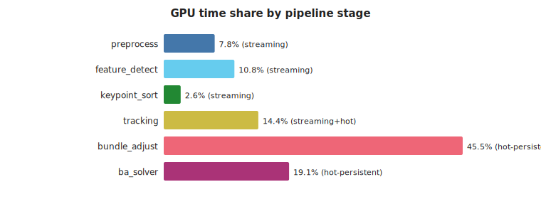
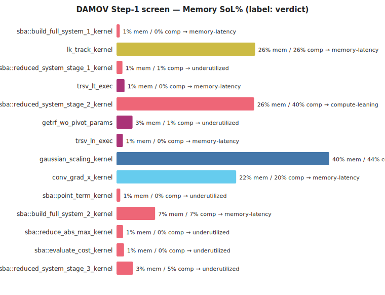
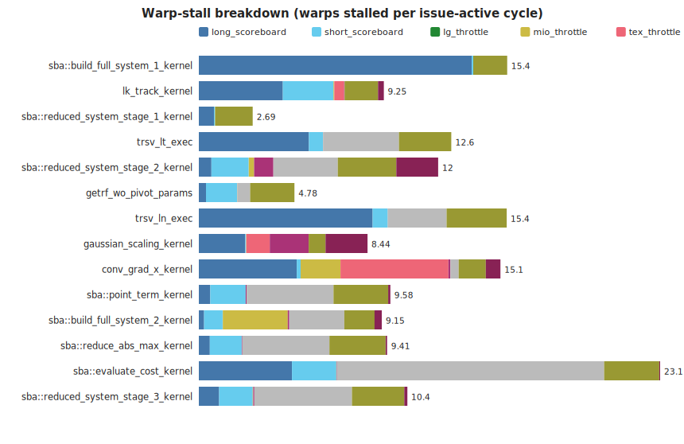
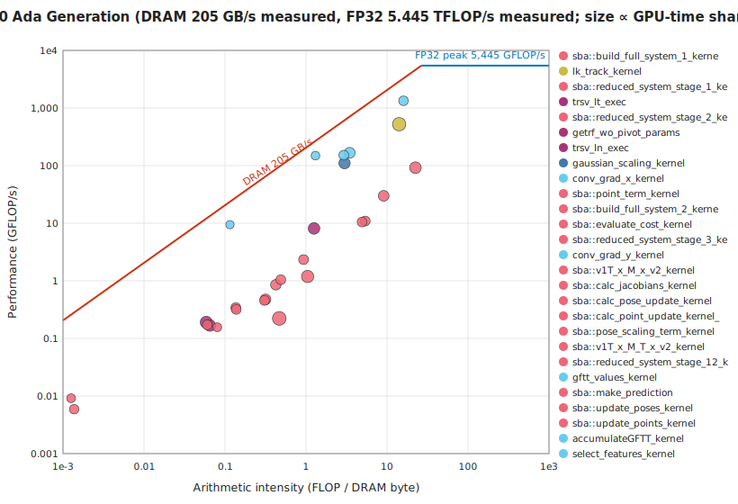
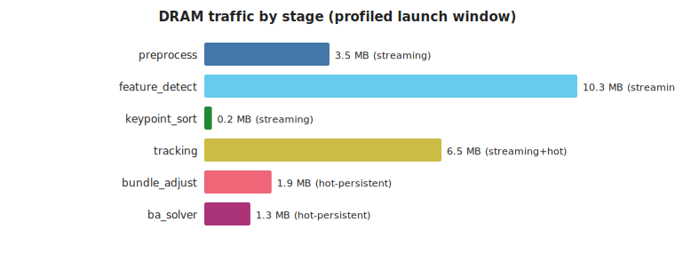
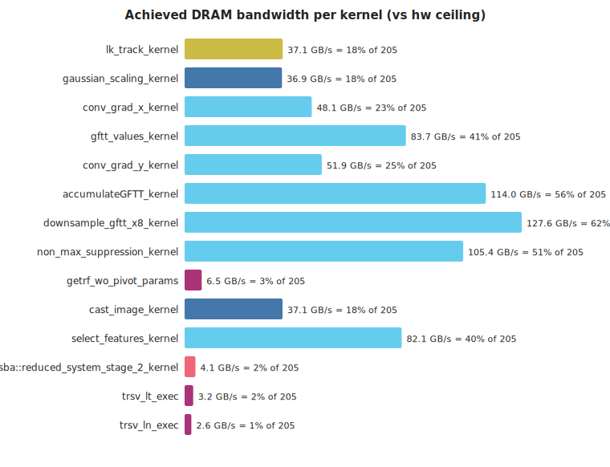
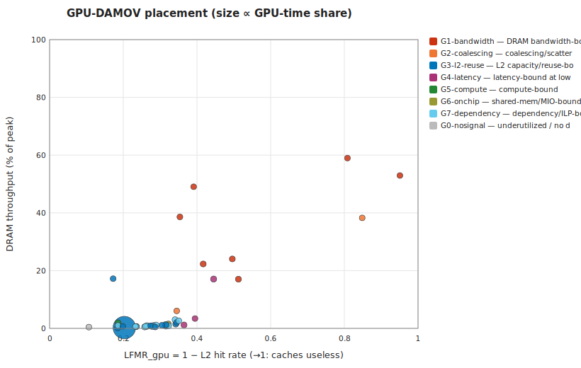

# cuVSLAM memory characterization — TUM-VI corridor1 fisheye, RTX 2000 Ada (locked clocks)

*Generated 2026-07-03 13:25 by `analysis/make_report.py` — headless, stdlib-only.*

## 1. Provenance

**Hardware descriptor:** `hw/dellworkstation_sm89.toml` — NVIDIA RTX 2000 Ada Generation (Ampere/Ada, sm_89, 22 SMs, L2 24576 KiB, DRAM 224.0 GB/s theoretical, no ECC). Role: **production**.

- **run:** `2026-07-03_125640_mav0_nsys_dellworkstation_sm89`
  - GPU NVIDIA RTX 2000 Ada Generation · driver 610.43.02 · clocks 1620 MHz/7001 MHz
  - config `profiling/configs/tumvi_corridor1_profile.toml` · frames as-config · cuvslam 15.0.0
  - nsys NVIDIA Nsight Systems version 2026.1.3.425-261338342291v0

- **run:** `2026-07-03_125722_mav0_ncu_dellworkstation_sm89`
  - GPU NVIDIA RTX 2000 Ada Generation · driver 610.43.02 · clocks 1620 MHz/7001 MHz
  - config `profiling/configs/tumvi_corridor1_profile.toml` · frames as-config · cuvslam 15.0.0
  - ncu NVIDIA (R) Nsight Compute Command Line Profiler
  - ncu window: launch-skip 43877 · launch-count 300 · metrics `characterize`

- **run:** `2026-07-03_125809_mav0_nsys_dellworkstation_sm89`
  - GPU NVIDIA RTX 2000 Ada Generation · driver 610.43.02 · clocks 1620 MHz/7001 MHz
  - config `profiling/configs/tumvi_corridor1_slam_profile.toml` · frames as-config · cuvslam 15.0.0
  - nsys NVIDIA Nsight Systems version 2026.1.3.425-261338342291v0

- **run:** `2026-07-03_125847_mav0_ncu_dellworkstation_sm89`
  - GPU NVIDIA RTX 2000 Ada Generation · driver 610.43.02 · clocks 1620 MHz/7001 MHz
  - config `profiling/configs/tumvi_corridor1_slam_profile.toml` · frames as-config · cuvslam 15.0.0
  - ncu NVIDIA (R) Nsight Compute Command Line Profiler
  - ncu window: launch-skip 40 · launch-count 120 · metrics `characterize`

## 2. Pipeline decomposition (kernel→stage DAG)

Workload: 260 frames, 57040 kernel launches (219.4/frame), 41 unique kernels, total GPU time 255.0 ms.

| stage | persistence hypothesis | what it is | GPU time % | launches | kernels |
|---|---|---|---|---|---|
| preprocess | streaming | image cast + Gaussian pyramid construction | 7.7 | 3120 | 2 |
| feature_detect | streaming | GFTT/Harris gradients, response, NMS, selection | 10.7 | 6229 | 8 |
| keypoint_sort | streaming | cub::DeviceMergeSort of detected keypoints | 2.6 | 1300 | 3 |
| tracking | streaming+hot | Lucas–Kanade pyramidal optical-flow tracking | 14.4 | 778 | 1 |
| bundle_adjust | hot-persistent | sparse bundle adjustment: system build + reduce + update | 45.5 | 33020 | 20 |
| ba_solver | hot-persistent | dense linear solve (cuSOLVER getrf/trsv) for BA | 19.1 | 12593 | 7 |

## 3. DAMOV Step-1 screen — which kernels are memory-bound

Rule (GPU adaptation): *memory-bound* if Memory-SoL ≥ 40% and ≥ 1.5× Compute-SoL; *memory-latency* if both SoLs are low but the dominant warp stall is a memory stall. Time-weighted across launches.

| kernel | stage | verdict | MemSoL% | CompSoL% | L1 hit% | L2 hit% | sectors/req (ld) |
|---|---|---|---|---|---|---|---|
| sba::build_full_system_1_kernel | bundle_adjust | memory-latency | 0.61 | 0.18 | 91.89 | 81.52 | 2.83 |
| lk_track_kernel | tracking | memory-latency | 25.95 | 25.95 | 87.83 | 55.47 | 2.32 |
| sba::reduced_system_stage_1_kernel | bundle_adjust | underutilized | 1.11 | 0.51 | 97.16 | 74.2 | 6 |
| trsv_lt_exec | ba_solver | memory-latency | 1.5 | 0.27 | 27.27 | 65.74 | 1.5 |
| sba::reduced_system_stage_2_kernel | bundle_adjust | compute-leaning | 25.77 | 40.09 | 40.85 | 81.42 | 2.33 |
| getrf_wo_pivot_params | ba_solver | underutilized | 2.99 | 0.71 | 39.74 | 65.94 | 5.84 |
| trsv_ln_exec | ba_solver | memory-latency | 1.19 | 0.17 | 27.27 | 63.52 | 1.5 |
| gaussian_scaling_kernel | preprocess | mixed | 39.83 | 44.43 | 91.84 | 48.75 | 0 |
| conv_grad_x_kernel | feature_detect | memory-latency | 22.39 | 20.37 | 64.51 | 58.32 | 0 |
| sba::point_term_kernel | bundle_adjust | underutilized | 0.7 | 0.21 | 72.42 | 72.3 | 5.5 |
| sba::build_full_system_2_kernel | bundle_adjust | memory-latency | 7.22 | 7.22 | 47.14 | 67.78 | 6.42 |
| sba::reduce_abs_max_kernel | bundle_adjust | underutilized | 1.22 | 0.23 | 0 | 73.53 | 3 |
| sba::evaluate_cost_kernel | bundle_adjust | underutilized | 1.4 | 0.22 | 76.44 | 67.7 | 5.65 |
| sba::reduced_system_stage_3_kernel | bundle_adjust | underutilized | 3.07 | 5.14 | 4.17 | 73.6 | 2.33 |
| conv_grad_y_kernel | feature_detect | memory-latency | 28.4 | 13.41 | 44.04 | 50.4 | 0 |
| sba::v1T_x_M_x_v2_kernel | bundle_adjust | underutilized | 2.94 | 4.62 | 15.63 | 71.8 | 2.33 |

### Warp-stall breakdown

## 4. Roofline placement

| kernel | stage | AI (FLOP/DRAM-byte) | GFLOP/s | DRAM GB/s |
|---|---|---|---|---|
| sba::build_full_system_1_kernel | bundle_adjust | 0.47 | 0.22 | 0.47 |
| lk_track_kernel | tracking | 14.12 | 524.13 | 37.11 |
| sba::reduced_system_stage_1_kernel | bundle_adjust | 1.05 | 1.19 | 1.13 |
| trsv_lt_exec | ba_solver | 0.06 | 0.19 | 3.24 |
| sba::reduced_system_stage_2_kernel | bundle_adjust | 22.45 | 92.12 | 4.1 |
| getrf_wo_pivot_params | ba_solver | 1.26 | 8.11 | 6.46 |
| trsv_ln_exec | ba_solver | 0.07 | 0.17 | 2.56 |
| gaussian_scaling_kernel | preprocess | 2.99 | 110.13 | 36.85 |
| conv_grad_x_kernel | feature_detect | 3.47 | 166.72 | 48.11 |
| sba::point_term_kernel | bundle_adjust | 0.32 | 0.47 | 1.5 |
| sba::build_full_system_2_kernel | bundle_adjust | 9.09 | 29.89 | 3.29 |
| sba::reduce_abs_max_kernel | bundle_adjust | 0 | 0 | 1.51 |
| sba::evaluate_cost_kernel | bundle_adjust | 0.42 | 0.85 | 2.01 |
| sba::reduced_system_stage_3_kernel | bundle_adjust | 5.39 | 10.89 | 2.02 |

## 5. DRAM traffic by stage

### Host↔device transfers (data movement the kernel view misses)

Explicit memcpy/memset time is **46 ms vs 255 ms of kernel time (18%)**; Host-to-Device moves **0.64 MB/frame** (the sensor-image upload — traffic a near-sensor substrate eliminates outright). Full table: `data/transfers.csv`.

## 6. Loop-closure (SLAM layer) delta

SLAM capture: full-sequence frames, 43 unique kernels (baseline had 41).

Kernels present **only** with `[slam]` enabled — the cold-persistent candidates:

| kernel | stage | persistence | GPU time % | launches |
|---|---|---|---|---|
| st_track_with_cache_kernel | slam_loop | cold-persistent | 40.91 | 485 |
| st_build_cache_kernel | slam_loop | cold-persistent | 0.61 | 1595 |

Their per-kernel memory profile (ncu, `characterize` set):

| kernel | verdict | MemSoL% | CompSoL% | L2 hit% | occupancy% | sectors/req (ld) | DRAM MB/launch |
|---|---|---|---|---|---|---|---|
| st_track_with_cache_kernel | memory-latency | 0.58 | 0.33 | 79.72 | 2.08 | 7.42 | 2.7 |
| st_build_cache_kernel | memory-latency | 1.51 | 0.59 | 68.4 | 2.08 | 2.75 | 0.0 |

## 7. GPU-DAMOV classification — PiM/ISP candidates

Bottleneck classes per the GPU-adapted DAMOV taxonomy (`suggestions_and_summuries/Adapting_DAMOV_to_GPU.md` §6; [Oliveira21] for the CPU original). This is the NCU-counter **first-cut** classification — single-point LFMR_gpu (= 1 − L2 hit), MPKI, DRAM-SoL, coalescing, occupancy, stall taxonomy. The gated Slice-3 trace/simulation track refines it (LFMR-vs-#SM trend, divergence, true reuse distance) but is not required to produce it.

**Synthesis — stage → dominant class → PiM/ISP affinity** (time-weighted within stage):

| stage | persistence | dominant class | share | PiM affinity | substrate |
|---|---|---|---|---|---|
| preprocess | streaming | G1-bandwidth | 85% of stage time | strong | near-sensor SRAM (consume before DRAM) |
| feature_detect | streaming | G1-bandwidth | 95% of stage time | strong | near-sensor SRAM (consume before DRAM) |
| keypoint_sort | streaming | G3-l2-reuse | 36% of stage time | weak | weak, cache-friendly |
| tracking | streaming+hot | G4-latency | 100% of stage time | strong | near-memory compute (latency, uncacheable set) |
| bundle_adjust | hot-persistent | G7-dependency | 50% of stage time | none | host GPU — raise occupancy/ILP first, then re-screen |
| ba_solver | hot-persistent | G7-dependency | 46% of stage time | none | host GPU — raise occupancy/ILP first, then re-screen |
| slam_loop | cold-persistent | G3-l2-reuse | 100% of stage time | weak | weak, cache-friendly |

Per-kernel placement (top by profiled time; full table in `data/classification.csv`). *Stability* = the class survives all decision thresholds perturbed ±25%:

| kernel | class | conf | stability | PiM | substrate | rationale |
|---|---|---|---|---|---|---|
| st_track_with_cache_kernel | G3-l2-reuse | medium | borderline:G2-coalescing↔G3-l2-reuse | weak | weak, cache-friendly | memory-limited but LFMR 0.20 — the L2 is earning its keep |
| st_build_cache_kernel | G3-l2-reuse | medium | borderline:G3-l2-reuse↔G4-latency | weak | weak, cache-friendly | memory-limited but LFMR 0.32 — the L2 is earning its keep |
| sba::build_full_system_1_kernel | G3-l2-reuse | medium | stable | weak | bigger/persisted L2 wins; PiM would forfeit the reuse | memory-limited but LFMR 0.18 — the L2 is earning its keep |
| lk_track_kernel | G4-latency | low | borderline:G1-bandwidth↔G4-latency | strong | near-memory compute (latency, uncacheable set) | long-scoreboard dominant at 22% occupancy, DRAM-SoL 17%; only n=3 profiled launches — small sample |
| sba::reduced_system_stage_1_kernel | G7-dependency | medium | stable | none | host GPU — raise occupancy/ILP first, then re-screen | 'wait' stall dominant at 2% occupancy; memory is not the wall (MemSoL 1%, DRAM-SoL 1%) |
| trsv_lt_exec | G3-l2-reuse | medium | borderline:G3-l2-reuse↔G4-latency | weak | bigger/persisted L2 wins; PiM would forfeit the reuse | memory-limited but LFMR 0.34 — the L2 is earning its keep |
| sba::reduced_system_stage_2_kernel | G5-compute | medium | borderline:G0-nosignal↔G5-compute | none | host GPU | CompSoL 40% dominant, AI 22.4 FLOP/B |
| getrf_wo_pivot_params | G7-dependency | medium | stable | none | host GPU — raise occupancy/ILP first, then re-screen | 'wait' stall dominant at 8% occupancy; memory is not the wall (MemSoL 3%, DRAM-SoL 3%) |
| trsv_ln_exec | G4-latency | medium | borderline:G3-l2-reuse↔G4-latency | conditional | raise occupancy first; PiM if the set defeats caches | long-scoreboard dominant at 7% occupancy, DRAM-SoL 1% |
| gaussian_scaling_kernel | G1-bandwidth | low | stable | strong | near-sensor SRAM (consume before DRAM) | memory-limited (MemSoL 40%) without a sharper signature |
| conv_grad_x_kernel | G1-bandwidth | low | borderline:G1-bandwidth↔G3-l2-reuse | strong | near-sensor SRAM (consume before DRAM) | memory-limited (MemSoL 22%) without a sharper signature |
| sba::point_term_kernel | G7-dependency | medium | stable | none | host GPU — raise occupancy/ILP first, then re-screen | 'barrier' stall dominant at 13% occupancy; memory is not the wall (MemSoL 1%, DRAM-SoL 1%) |
| sba::build_full_system_2_kernel | G6-onchip | medium | stable | none | host GPU | dominant stall mio_throttle (3.2 warps) with DRAM unsaturated |
| sba::reduce_abs_max_kernel | G7-dependency | medium | stable | none | host GPU — raise occupancy/ILP first, then re-screen | 'barrier' stall dominant at 15% occupancy; memory is not the wall (MemSoL 1%, DRAM-SoL 1%) |

Threshold sensitivity: 26/43 kernels keep their class under ±25% threshold perturbation; 17 are borderline (flagged above and in the CSV).

## 8. Persistence-class evidence so far

| stage | hypothesis | evidence in this capture |
|---|---|---|
| preprocess | streaming | 1/2 profiled kernels memory-bound |
| feature_detect | streaming | 4/8 profiled kernels memory-bound |
| keypoint_sort | streaming | 2/3 profiled kernels memory-bound |
| tracking | streaming+hot | 1/1 profiled kernels memory-bound |
| bundle_adjust | hot-persistent | 7/20 profiled kernels memory-bound |
| ba_solver | hot-persistent | 2/7 profiled kernels memory-bound |

Methodology caveats: ncu flushes caches between replay passes, so hit rates are cold-start (steady-state needs the gated Accel-Sim track); SoL/stall/traffic counters are robust. Simulated numbers, when they arrive, are reported as deltas, not absolutes.
